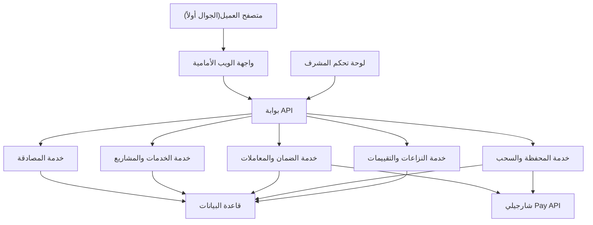

# Algerian Freelance Platform

Feature Name: algerian-freelance-platform
Updated: 2026-08-16

## Description

منصة خدمات مستقلة عربية للسوق الجزائري تجمع بين الخدمات المصغرة (سعر ثابت) والمشاريع بالمزايدات. تعتمد نظام دفع وسيط عبر بوابة شارجيلي Pay حصرياً (CIB + EDAHABIA) مع محفظة داخلية للبائعين، وعمولة 20% تتحملها المنصة. يتطلب التحقق المعزز بالهوية الوطنية من جميع المستخدمين قبل أي عملية تجارية.

## Architecture

**شرح المعمارية:** تطبيق أحادي (Monolith) مبسط وموزع منطقياً في خدمات داخلية، يسهل صيانته في النسخة الأولى ويتوسع لاحقاً. كل العمليات المالية تمر عبر خدمة الضمان التي تتكامل مع شارجيلي Pay.

## Components and Interfaces

### الواجهة الأمامية (Web)

- تقنية: React مع Vite، تصميم متجاوب للجوال أولاً
- لغة: العربية فقط (RTL)
- صفحات رئيسية: الرئيسية، البحث، تفاصيل خدمة، تفاصيل مشروع، ملف مستخدم، لوحات البائع/المشتري، الدفع (إعادة توجيه لشارجيلي)، لوحة المشرف

### بوابة API

- تقنية: Node.js + Express (أو Fastify)، RESTful JSON
- مسارات أساسية: `/api/auth`, `/api/services`, `/api/projects`, `/api/orders`, `/api/wallet`, `/api/disputes`, `/api/reviews`, `/api/admin`
- مصادقة: JWT + صلاحيات الأدوار (مشترٍ، بائع، مشرف)

### قاعدة البيانات

- تقنية: PostgreSQL
- وصف النماذج في قسم Data Models

### بوابة الدفع (شارجيلي Pay)

- تكامل عبر REST API الرسمي — **بوابة الدفع الوحيدة المعتمدة** (لا تُقبل وسائل دفع أخرى)
- تدفق: إنشاء طلب دفع ← تحويل المشتري ← استقبال webhook للتأكيد
- حساب واحد مركزي للمنصة (محفظة شارجيلي) + سحوبات تحويل للبائعين

### خدمة تحقق الهوية

- البريد + الهاتف: إرسال رموز تحقق
- **التحقق المعزز إلزامي لكل المستخدمين**: رفع صورة بطاقة الهوية الوطنية، مراجعة يدوية من المشرف، قبل السماح بأي عملية تجارية
- البائعون يضيفون إلزامياً الحساب البنكي/البريدي للسحب ضمن نفس التحقق

## Data Models

### users

| الحقل | النوع | ملاحظات |
|---|---|---|
| id | uuid | مفتاح أساسي |
| email | string | فريد |
| phone | string | فريد |
| password_hash | string | مشفر |
| role | enum | buyer / seller / admin |
| status | enum | pending / active / suspended / banned |
| verification_status | enum | none / pending / verified — إلزامي لكل المستخدمين |
| national_id_doc | string | مسار صورة الهوية — إلزامي للجميع |
| payout_account | string | حساب بنكي/بريدي للسحب — إلزامي للبائعين |
| rating_avg | float | متوسط التقييم |
| created_at | timestamp | |

### services

| الحقل | النوع | ملاحظات |
|---|---|---|
| id | uuid | مفتاح أساسي |
| seller_id | uuid | FK → users |
| category_id | uuid | FK → categories |
| title | string | |
| description | text | |
| price | int | بالدج |
| price_min | int | للخدمة حسب الطلب |
| type | enum | fixed / custom |
| delivery_days | int | مدة التسليم |
| image_url | string | |
| status | enum | draft / pending_review / active / rejected / disabled |
| review_reason | string | سبب الرفض |
| created_at | timestamp | |

### projects

| الحقل | النوع | ملاحظات |
|---|---|---|
| id | uuid | مفتاح أساسي |
| buyer_id | uuid | FK → users |
| category_id | uuid | FK → categories |
| title | string | |
| description | text | |
| budget_min | int | |
| budget_max | int | |
| deadline | date | |
| status | enum | open / reserved / closed / cancelled |
| expires_at | timestamp | |

### bids

| الحقل | النوع | ملاحظات |
|---|---|---|
| id | uuid | مفتاح أساسي |
| project_id | uuid | FK → projects |
| seller_id | uuid | FK → users |
| amount | int | بالدج |
| delivery_days | int | |
| message | text | |
| fee_paid | bool | رسوم رمزية مدفوعة |
| status | enum | pending / accepted / rejected / refunded |
| created_at | timestamp | |

### orders

| الحقل | النوع | ملاحظات |
|---|---|---|
| id | uuid | مفتاح أساسي |
| service_id | uuid | FK → services |
| project_id | uuid | FK → projects (للمشاريع) |
| buyer_id | uuid | FK → users |
| seller_id | uuid | FK → users |
| amount | int | المبلغ المحجوز |
| escrow_status | enum | held / released / refunded / disputed |
| commission | int | 20% |
| seller_amount | int | 80% |
| delivery_due_at | timestamp | |
| created_at | timestamp | |

### wallets

| الحقل | النوع | ملاحظات |
|---|---|---|
| id | uuid | مفتاح أساسي |
| user_id | uuid | FK → users |
| balance | int | رصيد داخلي بالدج |
| updated_at | timestamp | |

### transactions

| الحقل | النوع | ملاحظات |
|---|---|---|
| id | uuid | مفتاح أساسي |
| order_id | uuid | FK → orders |
| user_id | uuid | FK → users |
| type | enum | deposit / release / refund / payout / commission / fee |
| amount | int | |
| chargily_ref | string | مرجع شارجيلي |
| status | enum | pending / succeeded / failed |
| created_at | timestamp | |

### disputes

| الحقل | النوع | ملاحظات |
|---|---|---|
| id | uuid | مفتاح أساسي |
| order_id | uuid | FK → orders |
| buyer_id | uuid | FK → users |
| seller_id | uuid | FK → users |
| status | enum | open / under_review / resolved |
| resolution | enum | seller_full / buyer_full / partial |
| penalty | int | رسوم البائع الخاسر 5% |
| admin_note | text | |
| created_at | timestamp | |

### reviews

| الحقل | النوع | ملاحظات |
|---|---|---|
| id | uuid | مفتاح أساسي |
| order_id | uuid | FK → orders |
| reviewer_id | uuid | FK → users |
| reviewee_id | uuid | FK → users |
| rating | int | 1-5 |
| comment | text | |
| status | enum | hidden / visible |
| created_at | timestamp | |

### categories

| الحقل | النوع | ملاحظات |
|---|---|---|
| id | uuid | مفتاح أساسي |
| name | string | برمجة، تصميم، كتابة، ترجمة، تسويق... |
| icon | string | |

## Correctness Properties

1. مبلغ الضمان لا يتجاوز أبداً: `amount = commission (20%) + seller_amount (80%)`
2. محفظة البائع لا تصبح سالبة: كل عملية سحب تتحقق من الرصيد قبل التنفيذ
3. لا يُحرَّر مبلغ الضمان إلا بحالة واحدة: تأكيد المشتري أو انقضاء 3 أيام أو قرار الوسيط
4. التحقق المعزز إلزامي لكل المستخدمين قبل أي عملية تجارية (شراء، نشر، عرض، سحب)
5. عرض المزايدة يُقبل فقط إذا كان تصنيف المستقل مطابقاً لتصنيف المشروع وبسعر داخل النطاق
6. التقييمان يظهران معاً: لا يمكن إظهار تقييم واحد قبل انتهاء مهلة الطرف الآخر (7 أيام)
7. سجل التدقيق غير قابل للتعديل: كل المعاملات المالية تُسجَّل كسجل ثابت
8. لا تُحذف السجلات المالية نهائياً: تُعطَّل عملياً فقط
9. لا تُعتمد أي معاملة دفع لا تمر عبر شارجيلي Pay

## Error Handling

| السيناريو | المعالجة |
|---|---|
| فشل دفع شارجيلي | عرض رسالة خطأ، إلغاء الطلب، لا حجز مبالغ |
| webhook دفع لم يُستقبل | مهمة دورية تحقق حالة الطلب من شارجيلي وتحدّثه |
| فشل تحويل السحب للبائع | يُحفظ المبلغ في المحفظة، حالة السحب = failed، إشعار للبائع |
| محاولة رفض خدمة دون سبب | يمنع النظام الرفض حتى يكتب المشرف السبب |
| نزاع ثالث في الشهر | رفض تلقائي + توجيه للدعم المباشر |
| انتهاء مهلة التقييم | تُعرض التقييمات المتاحة بعد 7 أيام |
| بائع محظور يحاول الدخول | رفض الدخول مع رسالة السبب |

## Test Strategy

1. **اختبارات الوحدات**: منطق العمولة (20/80)، قبول العروض (نطاق + تصنيف)، تحرير الضمان (3 أيام)
2. **اختبارات التكامل**: تدفق الشراء الكامل عبر محاكاة شارجيلي (sandbox)
3. **اختبارات API**: جميع مسارات REST مع مصادقة وصلاحيات
4. **اختبارات E2E**: رحلة المشتري (شراء → استلام → تقييم) ورحلة البائع (نشر → تسليم → سحب) ورحلة النزاع
5. **اختبارات واجهة**: عربية RTL، جوال أولاً، حالات متعددة المتصفحات

## References

[^1]: (Website) - [Chargily Pay — بوابة الدفع الجزائرية](https://chargily.com/dz/business/pay)
[^2]: (Website) - [Chargily Pay — Fees & Pricing](https://chargily.com/dz/business/pay/pricing)
